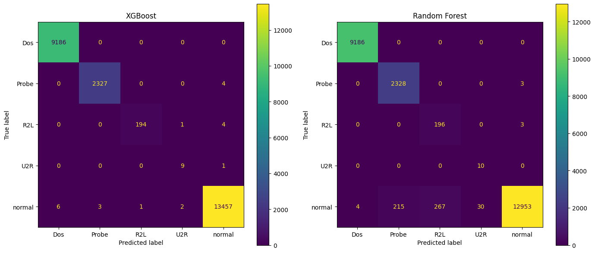
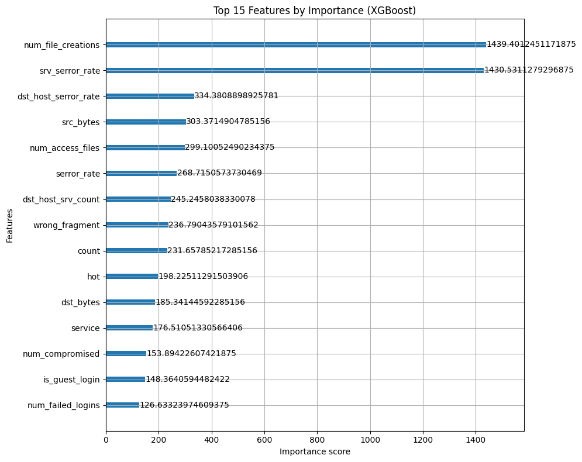

# Network Intrusion Detection using XGBoost

Multi-class network intrusion detection on the NSL-KDD dataset, classifying traffic into `normal`, `Dos`, `Probe`, `R2L`, and `U2R` categories. Built to compare boosting vs. bagging ensemble methods and to rigorously test generalization beyond a simple train/test split.

## Problem

Network intrusion detection systems need to distinguish normal traffic from several distinct attack types, each with very different behavioral signatures and — critically — very different amounts of available training data (U2R attacks make up only 0.04% of the dataset). This project builds a classifier that handles this imbalance and evaluates it two ways: on a random split of the training distribution, and on NSL-KDD's official test set, which is deliberately constructed to include attack variants not seen in training.

## Dataset

[NSL-KDD](https://www.unb.ca/cic/datasets/nsl.html) — an improved version of the classic KDD Cup 1999 dataset, addressing known redundancy issues in the original. 41 connection-level features (traffic volume, connection counts, error rates, host-based statistics) across 5 classes:

| Class | Description | Training samples |
|---|---|---|
| normal | Benign traffic | 67,342 |
| Dos | Denial of Service | 45,927 |
| Probe | Surveillance/scanning | 11,656 |
| R2L | Remote-to-Local unauthorized access | 995 |
| U2R | User-to-Root privilege escalation | 52 |

Download: `KDDTrain+.txt` and `KDDTest+.txt` from the link above or via [Kaggle](https://www.kaggle.com/datasets/hassan06/nslkdd) — place both in `data/`.

## Approach

1. **Preprocessing**: label-grouped 22 raw attack labels into the 5 categories above; encoded categorical features (`protocol_type`, `service`, `flag`) with `LabelEncoder`.
2. **Train/test split first, then preprocessing** — scaling (`MinMaxScaler`) and oversampling (`ADASYN`) are fit on the training set only and applied to test data using those same fitted transformers. This avoids data leakage that would otherwise inflate reported accuracy — a mistake I caught and corrected during development (see notes below).
3. **Model**: XGBoost (`multi:softmax`, tuned learning rate), benchmarked against a Random Forest baseline.
4. **Validation**: train-vs-test accuracy comparison and 5-fold cross-validation to check for overfitting, in addition to the held-out test split.
5. **Generalization test**: separately evaluated on NSL-KDD's official `KDDTest+` file, which is known to contain attack variants absent from training — a much harder and more realistic test than a random split of the same distribution.

## Results

**Random split (20% held out, same distribution as training):**

| Model | Accuracy |
|---|---|
| XGBoost | 99.91% |
| Random Forest | 97.93% |

XGBoost's advantage was concentrated in far fewer false positives on normal traffic (12 misclassified vs. Random Forest's 512), suggesting boosting captured subtler boundaries between benign and R2L/Probe-like traffic than bagging did.



**Overfitting check:** train accuracy 99.998% vs. test accuracy 99.91% (small gap); 5-fold CV mean F1 = 0.993 (std 0.006) — consistent with the held-out result, indicating stable generalization within the training distribution.

**Official NSL-KDD test set (`KDDTest+`, contains novel attack variants):**

Accuracy dropped to **77.9%** — a well-documented characteristic of this dataset. Performance held up well on `Dos`/`Probe`/`normal` but dropped sharply on `R2L` (recall 0.10) and `U2R` (recall 0.27), since the official test set includes attack subtypes never seen during training. This gap is a known property of NSL-KDD, deliberately designed to expose models that memorize rather than generalize.

## Feature Importance



The two dominant predictors are `num_file_creations` and `srv_serror_rate`. This aligns with attack mechanics: U2R attacks (rootkit, buffer overflow) typically create or modify files after compromising a system, while DoS/Probe attacks generate elevated connection error rates from scanning or flooding. Connection-behavior features dominate over any single raw traffic field, consistent with NSL-KDD's connection-level (not packet-content) feature design.

## Real-time detection (proof of concept)

Extended the model to a live packet-capture demo using `scapy`, approximating a subset of NSL-KDD features from raw packets and a sliding time window. This surfaced a genuine limitation worth stating plainly: several key features (e.g. file-system activity, several host-level aggregate statistics) require telemetry that isn't available from network packets alone. Production systems address this with dedicated flow-extraction tools (e.g. Zeek, CICFlowMeter). This demo should be read as a feasibility exploration, not a production-grade detector — see `realtime_demo.py`.

## Key takeaways

- Fixing a data-leakage bug in preprocessing (scaling/resampling before splitting) changed reported accuracy meaningfully — a reminder that high accuracy numbers need to be checked against methodology, not taken at face value.
- Evaluating only on a random split would have overstated real-world performance; the official test set gives a far more honest picture of generalization to unseen attack variants.
- Rare classes (R2L, U2R) remain hard regardless of resampling technique, because oversampling synthetic minority data can't manufacture genuinely novel attack *patterns* — only more examples of already-seen ones.

## How to run

```bash
pip install -r requirements.txt
# download KDDTrain+.txt and KDDTest+.txt into data/
jupyter notebook notebook.ipynb
```

## Future work

- Retrain using CICFlowMeter-extracted flow features (as in CICIDS2017/2018) to close the real-time feature gap identified above
- Explore SHAP values for per-prediction explainability
